# Highly Available AWS-Based NAT Gateway Alternative 

## Problem statement and requirements

Design and describe a highly available system in AWS that provides similar
features to a Managed NAT Gateway. The goal is to assess how you think about architecture,
scalability, resilience, and operational trade-offs.  

- The system should allow private subnets to initiate outbound connections to the internet while preventing unsolicited inbound connections.
- The design must emphasize high availability and fault tolerance across multiple Availability Zones.
- Consider aspects such as scalability, monitoring/alerting, and security best practices.
- Cost efficiency and operational simplicity are a plus but should not compromise availability.  

## Solution Diagram

_Right click and Open Image In New Tab for better view_  

## High Level Component Explanation
- VPC: Isolated foundation for all resources. It houses subnets, route tables and security groups.
- Internet Gateway: Allows the NAT instances in the subnets to connect to public internet.
- Public Subnet: Subnet with a route to the Internet Gateway and hosts the NAT instances.
- NAT Instance Autoscaling Group: Dedicated EC2 instance that forwards traffic from private instances to the internet. Placed in an Auto Scaling Group for high availability and self-healing.
- Private Subnet: Subnet with no direct route to the internet, hosting application servers and databases.
- Application Server: Backend services that need outbound internet access (for updates, consuming APIs, etc)
- Route Tables: Each private subnet has a route table that sends 0.0.0.0/0 (non-VPC traffic) to the NAT instance in its own Availability Zone, preventing cross Availability Zone data transfer costs and complexity.
- Lambda Function: Manages route table updates during Auto Scaling events with Lambda triggered by Lifecycle Hooks (e.g., on instance launch/terminate) to associate the new instance's ENI with the route table.

## Addressing Requirements  
#### Outbound-only connectivity:
- The NAT instance's Security Group only allows inbound traffic from the private subnets CIDR blocks.
- No inbound traffic from the internet is allowed.
#### High Availability and Fault Tolerance: 
- Architecture is replicated across multiple Availability Zones
- The Auto Scaling Group ensures that if a NAT instance fails it will be terminated and replaced by a healthy one.
- With the use of AZ-specific routing the failure of one NAT instance only affects its own AZ. Traffic from other AZs remains uninterrupted.
#### Scalability
- The Auto Scaling Group can be configured to scale the number of NAT instances based on metrics like network throughput or CPU utilization, handling increases in traffic.
#### Monitoring and Alerting
- CloudWatch integration with NAT instances stream metrics for real time monitoring. Also all NAT instance system logs and iptables activity are centralized in CloudWatch Logs for troubleshooting and audit purposes. Can configure CloudWatch Alarms and combine it with SNS for notifications and alerting.
#### Security Best Practices
- Security groups acting as stateful firewall, allowing outbound traffic to the internet and return traffic, but blocks all unsolicited inbound connections.
- Network ACLs acting as stateless firewall at the subnet level for another layer of security
- The NAT instance should be assigned an IAM role with the principle of least privilege, granting only the permissions for the needed operations like downloading patches.
#### Cost Efficiency
- Moving from a Managed NAT Gateway to NAT Instances will reduce NAT service costs
#### Operational Simplicity
- Infrastructure should be managed through IAC (Attached Python CDK Pseudo-Code in cdk_stack)  

## Trade-offs and considerations
#### Operational Complexity versus Cost and Control:
- Managed NAT Gateway: Patching, Scaling and Failover is managed by AWS. Oprationally simple but more expensive. Offers less control over underlying infra and inspection.
- NAT Instance Solution: We are responsible for managing patches and failover logic via user data and routing scripts. Adds operational overhead but more cost-effective service wise. Provides more control on underlying system.
- Bandwtidth: A NAT Gateway can scale up to 100 Gbps while NAT Instance Solution is limited by the chosen instance type. We can scale horizontall by adding more instances to the ASG.
- Example recommendation: If we are dealing with analytics environemnts with predictable but significant data processing workflows this NAT Instance Solution provides good balance of cost, control and resilience. Operational burden can be minimized through IAC and automation.

## Could this design realistically be implemented and operated?  

### Practical Assessment:  

#### Proven AWS Patterns
- Use autoscaling groups for stateless components
- Use Lambda for event driven automation
- Use multiple Azs for high availability
- Use Security Groups for statefull firewall  

#### Cost-Effective Operation
- Managed NAT: ~$32/month + $0.045/GB
- NAT Instance Solution: ~$15/month (t3.micro) + minimal Lambda costs
- Saving ~50% for steady-state traffic  

#### Operation simplicity
- Patching: Automated via ASG rolling updates
- Monitoring: CloudWatch + Alerts
- Scaling: Handled by ASG policies
- Failover: Automated with Lambda  

### Considerations and Mitigations  

#### Initial Complexity
- Challenge: More managed parts than Managed NAT
- Mitigation:
    - Manage Infrastructure with IAC
    - Well documented deployment process
    - Automated testing of failover scenarios  

#### Bandwidth Limitations
- Challenge: Instance-type dependent throughput
- Mitigation:
    - Start with t3.medium
    - Scale to c5/c6 instances for higher throughput
    - Monitor network metrics for scaling triggers  

#### Route Management Complexity
- Challenge: Lambda must handle routing correctly
- Mitigation:
    - Extensive error handling in Lambda code
    - Fallback routing strategies
    - Testing of edge cases  

### Production Readiness Checklist
- Multi-AZ deployment pattern
- Automated failover mechanism
- IAC
- Monitoring and Alerting
- Security best practices
- Cost optimization
- Documentation and runbooks

### Risk Mitigation Plan
- Lambda function failure:
    - Cloudwatch Alarms + SNS
    - Fallback to manual route updates
- Instance Performance Bottlenecks
    - Proactive scaling policies
    - Picking best size based on real metrics
- Configuration Drift:
    - Regular infra drift detection
    - Automated pipeline for updates
